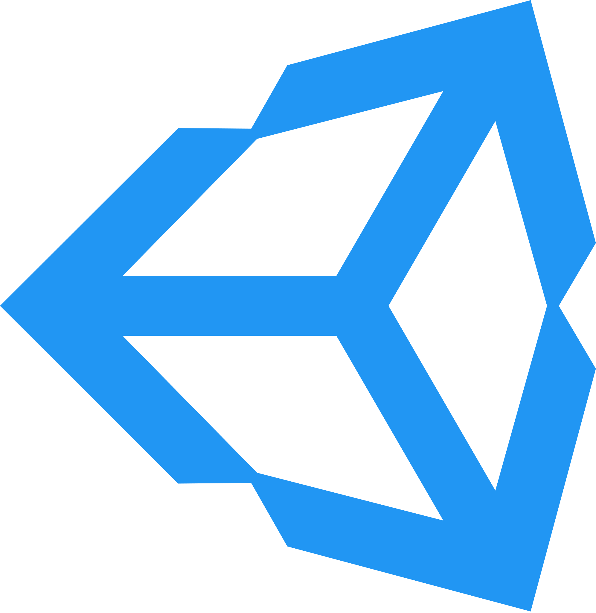
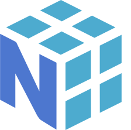

<h1 align="center">Hi there, I'm <a href="http://ilya.code.tilda.ws" target="_blank">Ilya</a> 
</h1>
<h3 align="center">Computer science student at HSE and software engineer from Moscow, Russia</h3>

### :curly_loop: Bio

### :trophy: Stats

### :hammer: Languages and Tools

  

  

  

  

  

 

  

  

  

### :email: Contacts

