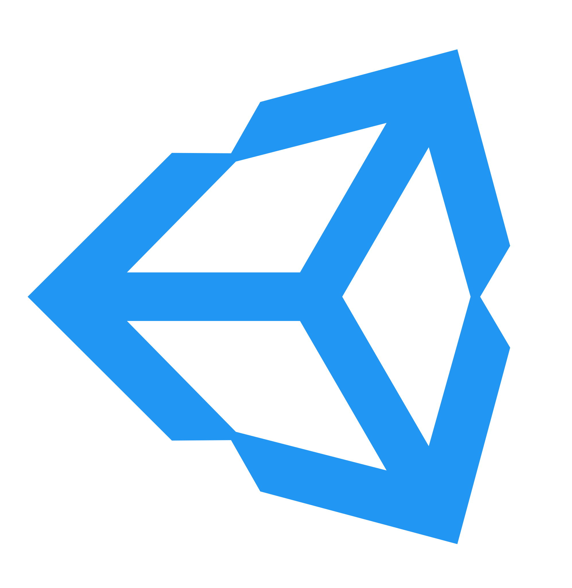

<h1 align="center">Hi there, I'm <a href="http://ilya.code.tilda.ws" target="_blank">Ilya</a> 
</h1>
<h3 align="center">Computer science student at HSE and software engineer from Moscow, Russia</h3>

### :curly_loop: Bio

### :trophy: Stats

### :hammer: Languages and Tools
<table>
    <tr height="50px">
        <th>Group</th>
        <th>Languages and Tools</th>
    </tr>
    <tr height="50px">
        <td>Languages</td>
        <td>
            
            
            
            
            
            
            
            
            
        </td>
    </tr>
    <tr height="50px">
        <td>Testing</td>
        <td>
            
            
            
            
            
        </td>
    </tr>
    <tr height="50px">
        <td>Databases</td>
        <td>
            
            
            
            
        </td>
    </tr>
    <tr height="50px">
        <td>DevOps</td>
        <td>
            
            
            
        </td>
    </tr>
    <tr height="50px">
        <td>Monitoring</td>
        <td>
            
            
        </td>
    </tr>
    <tr height="50px">
        <td>Brokers</td>
        <td>
            
            
            
        </td>
    </tr>
    <tr>
        <td></td>
        <td></td>
    </tr>
    <tr height="50px">
        <td>Graphics</td>
        <td>
            
            
            
            
        </td>
    </tr>
    <tr height="50px">
        <td>Data analysis</td>
        <td>
            
            
            
             
            
        </td>
    </tr>
    <tr height="50px">
        <td>Frameworks</td>
        <td>
            
            
            
            
            
        </td>
    </tr>
    <tr>
        <td></td>
        <td></td>
    </tr>
    <tr height="50px">
        <td>OS</td>
        <td>
            
            
            
            
        </td>
    </tr>
    <tr height="50px">
        <td>IDE</td>
        <td>
            
            
            
            
        </td>
    </tr>
    <tr height="50px">
        <td>Utils</td>
        <td>
            
            
            
            
        </td>
    </tr>
    <tr height="50px">
        <td>Team</td>
        <td>
            
            
            
            
        </td>
    </tr>
</table>

  

### :email: Contacts

